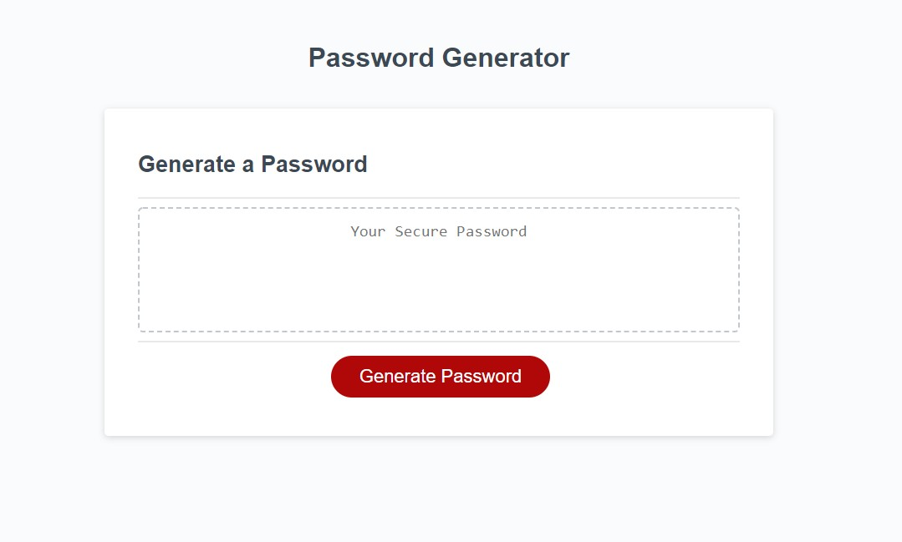
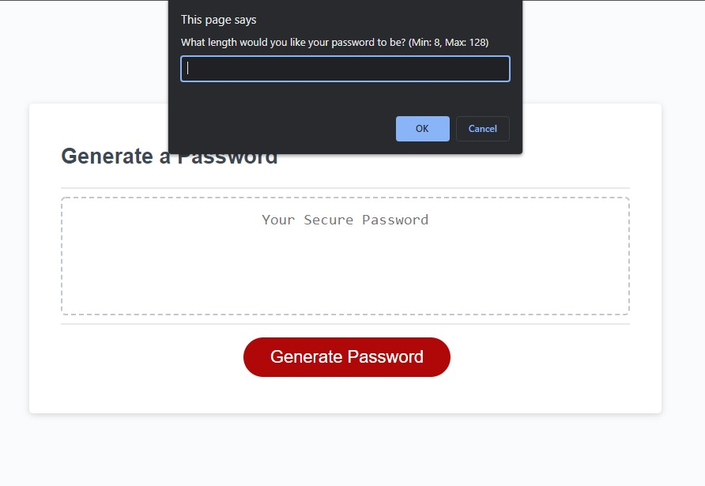
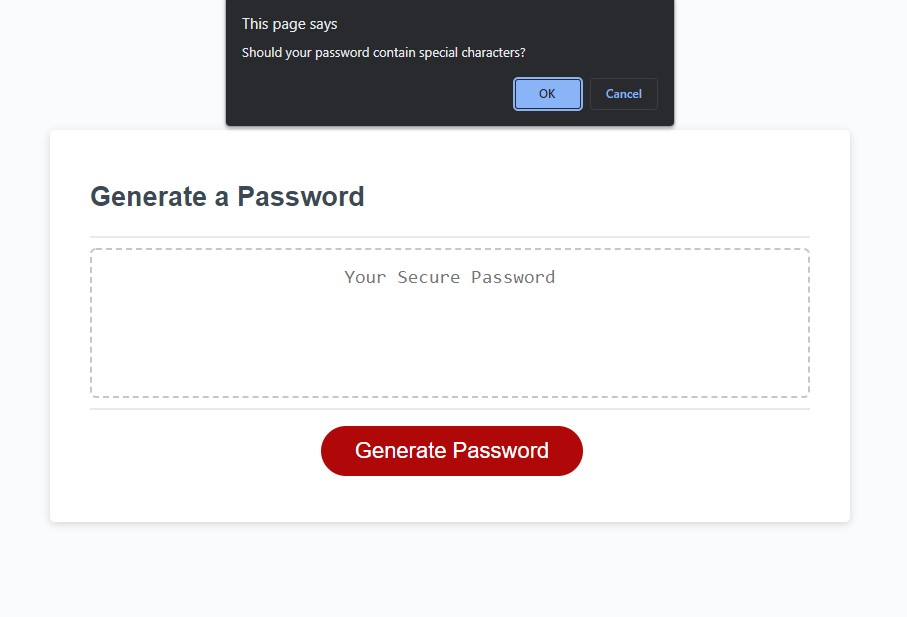
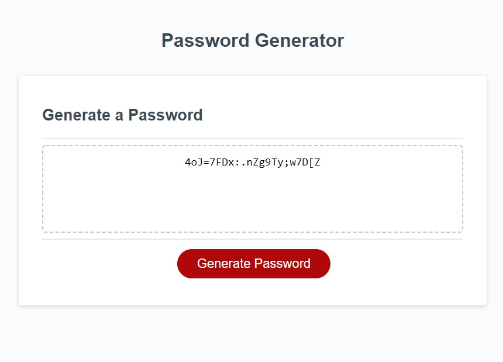

# 03 JavaScript: Password Generator

## Description 
This project was to create the logic needed to make a password generator. The HTML and CSS for the application was provided with a small amount of JavaScript, and the goal was to complete the JavaScript to meet the criteria. The application must prompt the user to input the desired password length and select which character types to use and validate their inputs. Once validated, the password should be generated and displayed to the user. 

List of [special characters](https://www.owasp.org/index.php/Password_special_characters) that were used, excluding the space character.

## User Story

```
AS AN employee with access to sensitive data
I WANT to randomly generate a password that meets certain criteria
SO THAT I can create a strong password that provides greater security
```

## Acceptance Criteria

```
GIVEN I need a new, secure password
WHEN I click the button to generate a password
THEN I am presented with a series of prompts for password criteria
WHEN prompted for password criteria
THEN I select which criteria to include in the password
WHEN prompted for the length of the password
THEN I choose a length of at least 8 characters and no more than 128 characters
WHEN prompted for character types to include in the password
THEN I choose lowercase, uppercase, numeric, and/or special characters
WHEN I answer each prompt
THEN my input should be validated and at least one character type should be selected
WHEN all prompts are answered
THEN a password is generated that matches the selected criteria
WHEN the password is generated
THEN the password is either displayed in an alert or written to the page
```

## Product

The deployed application can be found here: [Password Generator](https://cnohilly.github.io/password-generator/)

The following images display the appearance and functionality of the deployed application:

Base App:


Size Prompt:


Character Prompt:


Example Generated Password:
